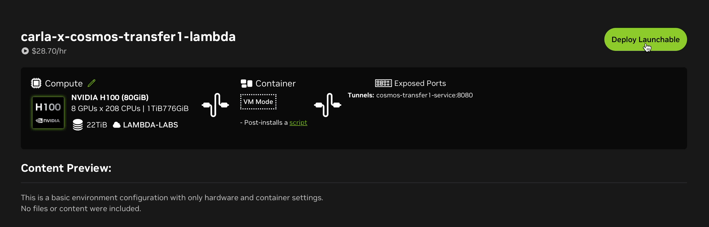
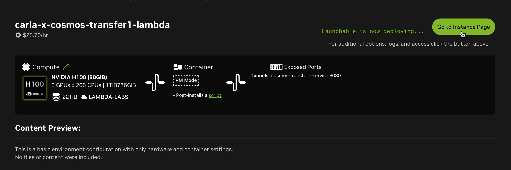
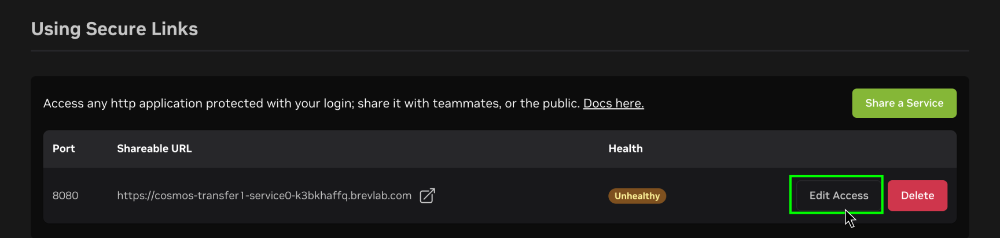
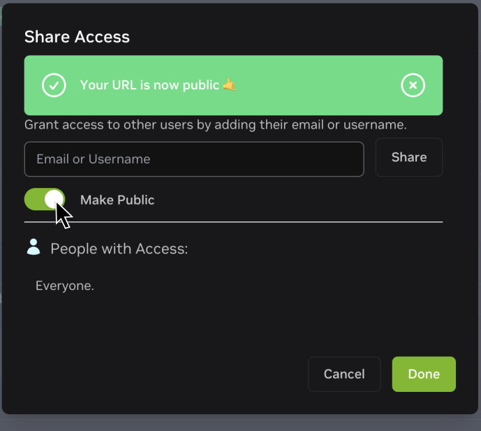
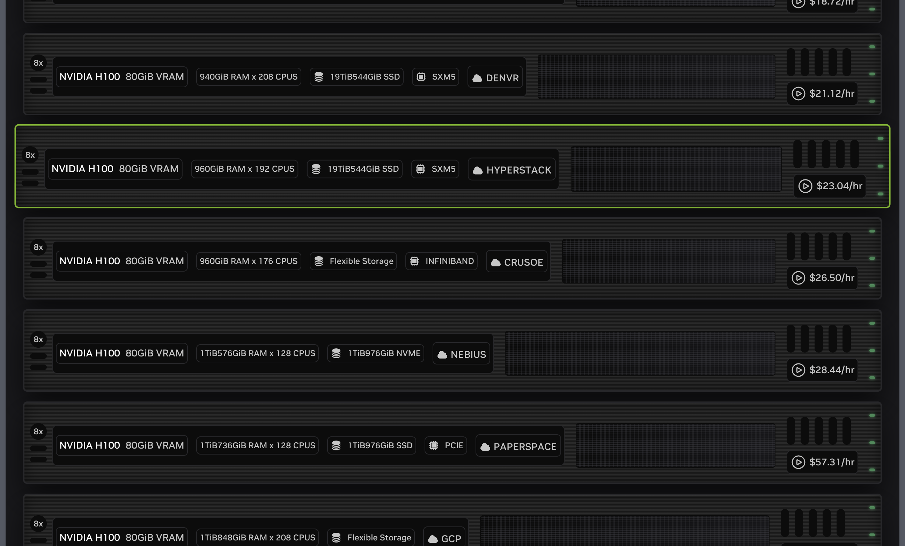

# Working with CARLA x Cosmos Transfer

CARLA can be connected to NVIDIA Cosmos Transfer to create hyper-realistic variations of the synthetic data generated in CARLA. 

In this integration, CARLA generates a set of videos, including RGB, semantic segmentation, depth, and edges, used to control Cosmos Transfer. These control videos are generated by using the `carla_cosmos_gen.py` script. Cosmos Transfer uses these control videos in combination with a text prompt and some additional tuning parameters to produce new variations of the video.

This integration is presented in the form of a client-server architecture. The `cosmos_client.py` script sends queries to a Cosmos Transfer server, and the server is responsible for completing the request sending videos back to the client (This process takes 1-2 minutes). To this end, users need to first deploy a Cosmos Transfer service. In the next section, we explain the different options to deploy your own Cosmos Transfer service. 

* __[Deploying a Cosmos Transfer server](#deploying-a-cosmos-transfer-server)__
    * [Option 1: 1-click deployment on NVIDIA Brev](#option-1-1-click-deployment-on-nvidia-brev)
    * [Option 2: Deploying your own service somewhere else](#option-2-deploying-your-own-service-somewhere-else)
* __[Using the CARLA x Cosmos Transfer Client](#using-the-carla-x-cosmos-transfer-client)__
    * [Dependency installation](#install-dependencies)
    * [Generating Cosmos-Transfer control inputs](#generating-cosmos-transfer-control-inputs)
    * [Generating style-transfer variations using Cosmos Transfer](#generating-style-transfer-variations-using-cosmos-transfer)
    * [Understanding the Cosmos-Transfer configuration](#understainding-the-cosmos-transfer-configuration)

--- 
# Deploying a Cosmos Transfer server

Cosmos Transfer requires high-performance datacenter GPUs such as the NVIDIA H100. We have created multiple ways to deploy Cosmos Transfer servers easily.

## Option 1: 1-click deployment on NVIDIA Brev

The CARLA team has created a Brev launchable to enable users to create their own Cosmos Transfer servers with ease. To this end:

__1.__ Sign up to NVIDIA Brev [here](https://login.brev.nvidia.com/signin). Follow the instructions on the website  to fund your account.

__2.__ Go to the link [carla-x-cosmos-transfer1-lambda](https://brev.nvidia.com/launchable/deploy/now?launchableID=env-32CoARmRgbQdxkQeHHkWfvRj87T). Click on *Deploy Launchable*.
{ style="padding:1rem;" }

__3.__ Click on *Go to Instance Page*.
{ style="padding:1rem;" }

__5.__ Wait until the instance has started.
{ style="padding:1rem;" }
__6.__ Make the URL public. 

>Click on *Edit Access* (take a note of the *Shareable URL* and port):

{ style="padding:1rem;" }

>Toggle *Make Public*:

{ style="padding-left:5rem;padding-right:5em;padding-top:1rem;" }

__7.__ Your Cosmos Transfer service is ready!

!!! note
    You may encounter limited amount of GPU instances in a particular cloud vendor. In those cases try changing to a different provider as follows: 
    { style="padding:1rem;" }
    { style="padding:1rem;" }

---

## Option 2: Deploying your own service somewhere else

If you have access to the appropriate hardware, you can deploy Cosmos Transfer in a Docker container. The files required to build the server image can be found in the `PythonAPI/examples/nvidia/cosmos/server` directory inside the root folder of your CARLA installation or package. Follow these steps to build and deploy a Cosmos Transfer server:

__1.__ **Install Docker**: If Docker is not already installed on your system, [install it](https://docs.docker.com/engine/install/).

__2.__ **Install Conda**: Follow [these instructions](https://docs.conda.io/projects/conda/en/latest/user-guide/install/index.html) to install Conda.

__3.__ **Build the server**

>Open a terminal inside `PythonAPI/examples/nvidia/cosmos/server` and run the `make_docker.sh` script:

```sh
./make_docker.sh
```

>This step is likely to take 1-2 hours.

__4.__ __Deploy__

>Deploy your docker image in your favorite environment. We recommend a cluster with at least 8 x H100 GPUs. A single H100 GPU should be enough for lower workloads. Run the docker image with the following command:

```bash
docker run -d --shm-size 96g --gpus=all --ipc=host -p 8080:8080 cosmos-transfer1-carla
```

__5.__ __Make requests with the client__

>Once you have deployed your Cosmos server, you can make requests to it using the `cosmos_client.py` script, providing the appropriate IP address and port for the `endpoint` argument.

>For example, for a locally deployed server on port 8080:

```sh
python cosmos_client.py http://localhost:8080 example_data/prompts/rain.toml
```

---

# Using the CARLA x Cosmos Transfer Client

In order to start generating videos, you will need to [install the dependencies](#installing-dependencies) for the Cosmos Transfer client. The Cosmos Transfer generation process involves two steps:

__1.__ [__Generating control videos for Cosmos Transfer with CARLA__](#generating-cosmos-transfer-control-inputs)

>This step generates several control videos for Cosmos Transfer from a CARLA simulation log file. The videos generated may include the following:
>
>* RGB
>* Depth
>* Edges 
>* Semantic segmentation
>* Instance segmentation
>* Sky mask

__2.__ [__Generating style-transfer variations using Cosmos Transfer__](#generating-style-transfer-variations-using-cosmos-transfer1)

>This step generates style-transfer variations of the original control videos using the Cosmos Transfer1 model. The control videos created by CARLA are sent through to a server running the Cosmos Transfer1 model. Requests are sent to the server through a simple API using the `cosmos_client.py` script. 

>The Cosmos Transfer1 model can be controlled using the prompt and several other control parameters defined in a TOML file. You can find numerous examples of Cosmos Transfer1 configurations inside the `client/example_data/prompts` directory. 

---

## Install dependencies

__1.__ Download CARLA [0.9.16](https://github.com/carla-simulator/carla/releases/tag/0.9.16) or the latest nightly build [here](https://carla.readthedocs.io/en/latest/download/#nightly-build)

__2.__ Once downloaded, uncompress the archive:

```sh
tar -xzvf CARLA_0.9.16.tar.gz
```

__3.__ Install `conda`, see [these instructions](https://docs.conda.io/projects/conda/en/latest/user-guide/install/index.html). You can skip this step if conda is already installed on your system.

__4.__ Create a conda environment (e.g., `carla-cosmos-client`) and install all dependencies:

```sh
cd PythonAPI/examples/nvidia/cosmos
# Create the carla-cosmos-client conda environment.
conda env create --file client/carla-cosmos-client.yaml
# Activate the carla-cosmos-client conda environment.
conda activate carla-cosmos-client
# Install the dependencies.
pip install -r requirements.txt
pip install -r client/requirements_client.txt 
```
__5.__ To install CARLA Python Client navigate to the `PythonAPI/carla/dist` folder within the CARLA installation. Locate the `.whl` file corresponding to your Python version (e.g., `carla-0.9.16-cp310-cp310-linux_x86_64.whl`):
```sh
# Replace carla-0.9.16-cp310-cp310-linux_x86_64.whl with your actual filename
pip install carla-0.9.16-cp310-cp310-linux_x86_64.whl
```

---

## Generating Cosmos-Transfer Control Inputs

__1.__ __Start CARLA__

>Navigate to the root folder of your CARLA installation and execute the launch script:

```sh
./CarlaUE4.sh
```

__2.__ __Generate control videos from a CARLA log__

>If you want to generate new control inputs using an example, you can run the `PythonAPI/examples/nvidia/cosmos/client/carla_cosmos_gen.py` with the example named **iai_carla_synthetic_log_1731622446_actorPOV4641_startTime3.7s_log.log** in the `PythonAPI/examples/nvidia/cosmos/client/example_data/logs/inverted_ai/` directory. You will find several other example log files in the same directory to experiment with.

>A typical invocation will look like this:

```sh
cd PythonAPI/examples/nvidia/cosmos/client
# Replace /full_path_to_log/your_log.log with the absolute path to your log file and output_path with your path to store the results (can be a relative path)
python carla_cosmos_gen.py -f full_path_to_log/your_log.log --sensors cosmos_aov.yaml --class-filter-config filter_semantic_classes.yaml -c ego_sim_id -s 0.0 -d 5.0 -o output_path
```

>The `ego_sim_id` value is the actor ID of the ego vehicle, for the Cosmos generation script to identify it. If you are recording your own scenarios, remember to note the Ego vehicle's actor ID from the `id` attribute.

>For example:

```sh
 python carla_cosmos_gen.py -f ${PWD}/example_data/logs/inverted_ai/iai_carla_synthetic_log_1731622446_actorPOV4641_startTime3.7s_log.log \ 
 --sensors cosmos_aov.yaml \
 --class-filter-config filter_semantic_classes.yaml \
 -c 4641 -s 0.0 -d 5.0 -o output
```

>**Note**: For the example log, replace `ego_sim_id` with 4641.

>This will produce a set of videos that will be later used to control Cosmos Transfer.

---

## Generating style-transfer variations using Cosmos Transfer

Once you have a set of artifacts and the Cosmos Transfer service has been deployed and is active, use the `cosmos_client.py` script to make requests. The following command will generate Cosmos Transfer style-transfer videos for the prompt and parameters found in the `rain.toml` example configuration file found in `client/example_data/prompts`. 

```sh
cd PythonAPI/examples/nvidia/cosmos/client
# Replace https://url_to_server with the URL to your CARLA-Cosmos-Transfer server
python cosmos_client.py http://url_to_server:port example_data/prompts/rain.toml
```
The first argument is the URL and port of the Cosmos Transfer server. If you are running a local server from a Docker container, this may be `localhost` or the network IP address of your server. If you are using NVIDIA Brev, the appropriate URL and port are given in the details of the Brev instance.

You can edit the text prompt and control parameters in the `rain.toml` configuration to experiment and see the effects. Numerous other examples are provided in the same directory and you can learn more about the parameters in the [following section](#understainding-the-cosmos-transfer-configuration).

You can optionally override some fields from the TOML on the command line and choose where to save the output:

```sh
python cosmos_client.py http://url_to_server:port \
  example_data/prompts/rain.toml \
  --output outputs/ \
  --input-video example_data/artifacts/rgb.mp4 \
  --edge-video example_data/artifacts/edges.mp4 \
  --depth-video example_data/artifacts/depth.mp4 \ # optional
  --seg-video example_data/artifacts/semantic_segmentation.mp4 \
  --vis-video example_data/artifacts/vis_control.mp4 \ # optional
  --seed 2048
```

---

## Understanding the Cosmos-Transfer Configuration

This section describes the TOML configuration (see `example_data/prompts/rain.toml`). The client accepts a flat schema as shown below, and also supports the same keys nested under a top-level `controlnet_specs` table.

### Required fields

| Field                | Type    | Description |
|----------------------|---------|-------------|
| `prompt`             | string  | Text describing the desired scene |
| `input_video_path`   | string  | Path to the input video file |
| `negative_prompt`    | string  | Text describing what to avoid in the output |
| `num_steps`          | int     | Number of diffusion steps |
| `guidance`           | float   | CFG guidance scale |
| `sigma_max`          | float   | Partial noise added to input; [0, 80]. `>= 80` ignores the input video |
| `seed`               | int     | Random seed for reproducibility |

### Optional scalar fields

| Field              | Type   | Description |
|--------------------|--------|-------------|
| `blur_strength`    | string | Blur strength for preparing the `vis` control input. One of: `very_low`, `low`, `medium`, `high`, `very_high` |
| `canny_threshold`  | string | Optional threshold preset used when generating edges externally |

### Controls (all optional)

If present, controls must follow these rules:

| Control | Required keys                              | Notes |
|---------|--------------------------------------------|-------|
| `edge`  | `input_control` (string)<br>`control_weight` (number) | Path typically points to an edges video |
| `depth` | `input_control` (string)<br>`control_weight` (number) | Path points to a depth video |
| `seg`   | `input_control` (string)<br>`control_weight` (number) | Path points to a semantic segmentation video |
| `vis`   | `control_weight` (number)                  | `input_control` is optional |

#### Validation constraints

The client validates the following aspects before sending the data:

__1.__ All required scalar fields above must be present and of the correct type.

__2.__ Controls are optional. If `edge`, `depth`, or `seg` are provided, both `control_weight` and `input_control` must be present. If `vis` is provided, `control_weight` must be present and `input_control` is optional.

Example TOMLs are provided in `client/example_data/prompts/`.

### Command-line arguments

`cosmos_client.py` accepts the following arguments:

| Argument             | Type    | Description |
|----------------------|---------|-------------|
| `endpoint`           | string  | Base URL of the server (e.g., `http://localhost:8080`) |
| `config_toml`        | string  | Path to the TOML configuration |
| `--output`           | string  | File or directory path to save the result video |
| `--input-video`      | string  | Override `input_video_path` from the TOML |
| `--edge-video`       | string  | Override `edge.input_control` |
| `--depth-video`      | string  | Override `depth.input_control` |
| `--seg-video`        | string  | Override `seg.input_control` |
| `--vis-video`        | string  | Override `vis.input_control` |
| `--seed`             | int     | Override `seed` |
| `--retries`          | int     | Max retries for uploads and generation (default: 3) |
| `--backoff-initial`  | float   | Initial backoff seconds (default: 1.5) |
| `--backoff-multiplier` | float | Exponential backoff multiplier (default: 2.0) |
| `--jitter`           | float   | Random jitter added to backoff (default: 0.5) |
| `--poll-interval`    | int     | Poll interval in seconds for job status (default: 5) |
| `--result-timeout`   | int     | Timeout in seconds when fetching job results (default: 120) |

